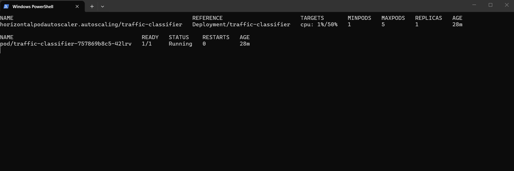
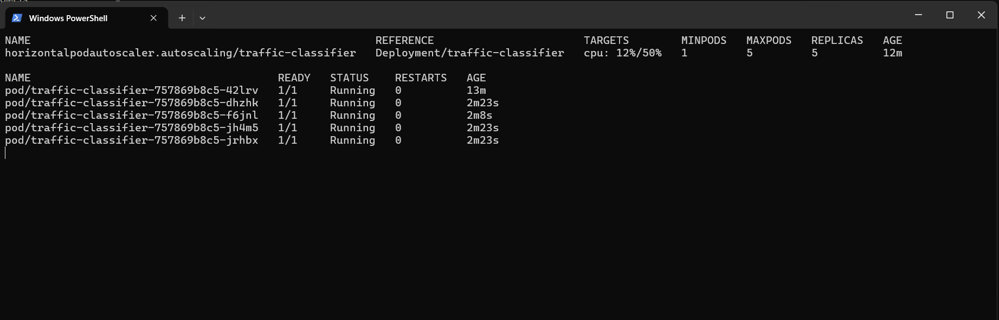

# End-to-End MLOps Pipeline 🚦🤖

An end-to-end MLOps pipeline for classifying VPN network traffic, covering data preprocessing, model training with experiment tracking, a FastAPI serving layer, containerization, and Kubernetes deployment with autoscaling.

## 📋 Description

This project trains a Random Forest classifier to identify the type of application traffic (e.g. Browsing, VoIP, Streaming, P2P, and their VPN variants) from network flow features. It wraps the full lifecycle: data exploration, preprocessing, training with MLflow tracking and model registry, automated promotion of better-performing models, a FastAPI prediction service, CI via GitHub Actions, and Kubernetes manifests with a Horizontal Pod Autoscaler.

## ✨ Features

- **Data Preprocessing**: Handles sentinel negative values via NaN replacement and median imputation
- **Model Training**: Random Forest classifier with group-aware train/test splitting to avoid data leakage
- **Experiment Tracking**: MLflow logging of params, metrics, and models, with automatic promotion to a "production" alias when a new model outperforms the current one
- **Serving API**: FastAPI app with `/predict` and `/health` endpoints
- **CI Pipeline**: GitHub Actions workflow that trains the model and runs tests on every push
- **Containerization**: Dockerfile for building the API service
- **Kubernetes Deployment**: Deployment, Service, and HPA manifests for scaling the API based on CPU utilization

## 🚀 Getting Started

### Prerequisites
```
Python 3.12+
Docker
Kubernetes (optional, for deployment)
```

### Installation
```bash
git clone https://github.com/yourusername/end-to-end-mlops-pipeline.git
cd end-to-end-mlops-pipeline
pip install -r requirements.txt
```

### Train the Model
```bash
python -m src.train
```

### Run the API
```bash
uvicorn src.api:app --host 0.0.0.0 --port 8000
```

### Run with Docker
```bash
docker build -t mlops-pipeline .
docker run -p 8000:8000 mlops-pipeline
```

### Deploy to Kubernetes
```bash
kubectl apply -f k8s/
```

## 📊 Autoscaling

The Horizontal Pod Autoscaler scales the API deployment between 1 and 5 replicas based on CPU utilization (target: 50%).

<div align="center">
  
  <br/>
  <em>Pod count at low load</em>
  <br/><br/>
  
  <br/>
  <em>Scaled up under load</em>
</div>

## 🛠️ Built With

- **Language**: Python
- **ML**: scikit-learn, pandas, numpy
- **Experiment Tracking**: MLflow
- **API**: FastAPI, Uvicorn
- **Containerization**: Docker
- **Orchestration**: Kubernetes (Deployment, Service, HPA)
- **CI**: GitHub Actions

## 📄 License

This project is licensed under the MIT License - see the [LICENSE](LICENSE) file for details.

## <!-- CONTACT -->
<!-- END CONTACT -->